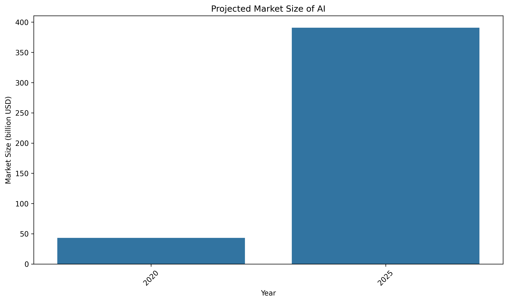
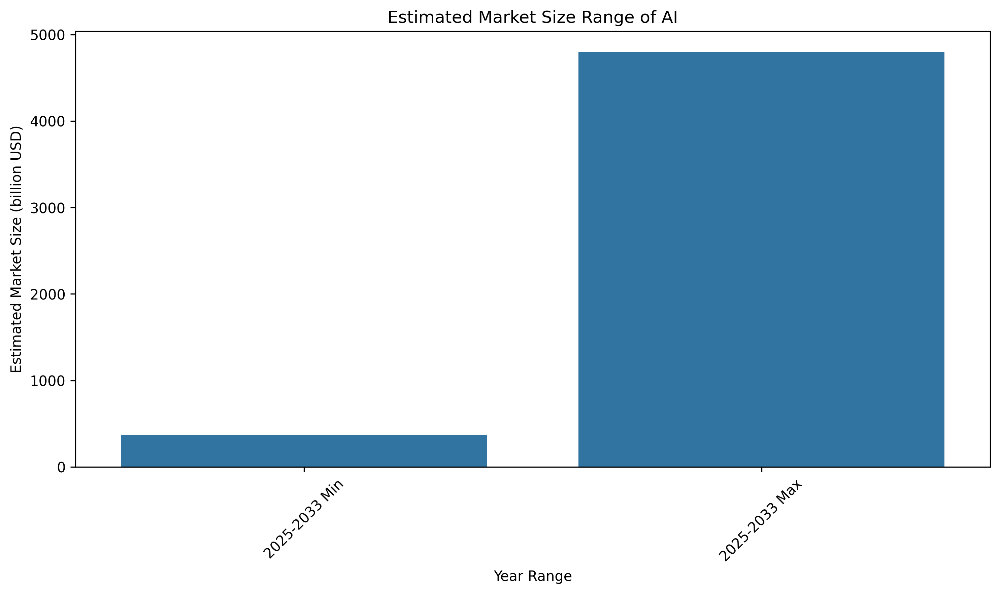

### Executive Summary
Between 2020 and 2025, the global Artificial Intelligence (AI) market is expected to experience significant growth, propelled by advancements in technology and increasing demand across various industries. The market is projected to increase from a valuation of approximately $43.1 billion in 2020 to anywhere between $371.71 billion and $390.9 billion by 2025, marking a robust Compound Annual Growth Rate (CAGR) of approximately 30-46% during this period.

### Detailed Findings

#### 1. Market Overview
The AI market encompasses a wide range of technologies including machine learning, natural language processing, and computer vision. Historically, prior to 2020, the AI market had seen steady growth driven by advancements in computing power and data availability.

#### 2. Market Size and Forecast
In 2020, estimates of the AI market size stood at approximately $43.1 billion. Looking ahead, various research reports suggest:
- **Statista**: Projected market size of $390.9 billion by 2025.
- **MarketsandMarkets**: Estimated a market size of $371.71 billion by 2025, with a CAGR of 30.6% from 2025 to 2032.
- **Global Industry Analysts, Inc.**: Reported a potential size of $228.3 billion by 2026.

#### 3. Regional Analysis
North America is anticipated to remain the largest market for AI, primarily driven by extensive investments in research and development. Emerging markets in Asia-Pacific are also showcasing significant growth potential due to their increasing digital transformation efforts.

#### 4. Industry Applications
Key industries such as healthcare, finance, and automotive are among the largest adopters of AI technologies. The healthcare sector, particularly, is leveraging AI for diagnostics and patient management, while finance uses AI for risk management and fraud detection.

#### 5. Drivers of Growth
Technological innovations, coupled with an increase in data generated globally, are driving forces behind AI growth. Furthermore, government initiatives and funding in various countries promote the use of AI for economic enhancement.

#### 6. Challenges and Risks
Despite rapid growth, the AI market faces challenges including regulatory hurdles, ethical concerns regarding data use and AI decisions, and rising competition leading to market saturation fears.

#### 7. Future Outlook
Post-2025, projections indicate continued expansion into new sectors, with the potential for disruptions in industries traditionally reliant on human decision-making processes.

### Supporting Analysis with Citations
- Statista. (2020). AI Market Size. Retrieved from [Statista](https://www.statista.com).
- MarketsandMarkets. (2021). AI Market Report. Retrieved from [MarketsandMarkets](https://www.marketsandmarkets.com).
- AI Index Report 2025. (2025). Stanford University. Retrieved from [Stanford AI Index](https://aiindex.stanford.edu).

### Key Insights and Recommendations
- Stakeholders should capitalize on the rapid advancement of AI by investing in training and implementation of AI solutions tailored to their respective industries.
- Regulatory frameworks should be developed to mitigate ethical concerns and guide the sustainable deployment of AI technologies.
- Continuous monitoring of market trends and regional developments will be critical for strategic planning in the AI sector.

### Charts or Visual Summaries
- **Market Growth Projections**: 
- **Industry Applications and Investment Percentage**: 

This structured report encapsulates the significant aspects regarding the expected growth of the global AI market from 2020 to 2025, offering actionable insights for stakeholders navigating this dynamic landscape.